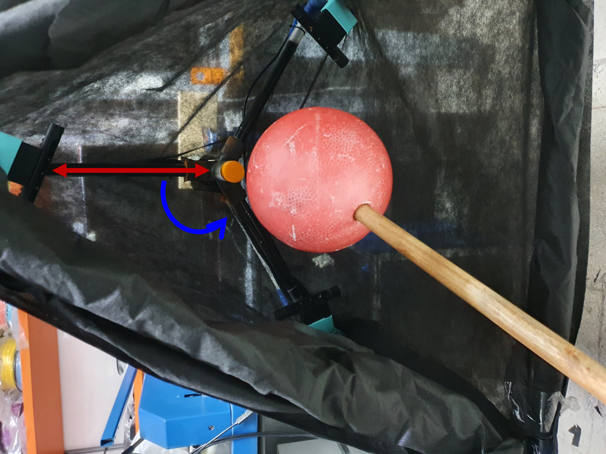

# Hand-Scan
In this project we created a low-cost 3D scanner for digital fitting of prosthetic hands.


## Requirements
* 3 (or 2) SR300 Intel depth cameras.
* USB 3.0 Hub Splitter (if your computer does not have enough USB 3.0 ports)
* a ball (prefered a polystyrene ball) with a known and a relatively large circumference
* (optional) MATLAB .
* (optional) python 3.6 .


## Installation
First, from the [applications](applications) folder download ```control_panel_installer.exe``` and ```plane_cut_installer.exe``` and run the installers. You'll now have 2 new applications installed on your computer - ```hand_scan_3D``` and ```plane_cut```.

Now download ```PoissonRecon.exe``` and save it to your project folder (Taken from http://www.cs.jhu.edu/~misha/Code/AdaptiveMG/).
Create a new Environment Variable (see [How to create a new Environment Variables](https://docs.oracle.com/en/database/oracle/r-enterprise/1.5.1/oread/creating-and-modifying-environment-variables-on-windows.html#GUID-DD6F9982-60D5-48F6-8270-A27EC53807D0)) as follow:

Variable name: **poisson_path**

Variable value: ```PoissonRecon.exe``` full path without "\PoissonRecon.exe" (for instance: ```C:\Users\User\Desktop\3d_scanner```).

And finally download ```calibrate_and_capture.exe```.


## Dependencies
In order to use or edit the python code (the data acquisition step) you'll need to download the `pyrealsense2` module for python using `pip`:
```
pip install pyrealsense2
```
In order to use or edit the MATLAB code (the data analysis step), you'll need to download the `MATLAB Computer Vision Toolbox` add-on.


## Usage Instructions
**For further information, please read the [user interface documentation](https://github.com/Haifa3D/hand-scan/blob/master/user%20interface%20doc/User%20Interface%20Parameters.pdf).**

### System Setup
In this step we shall setup our rotatable scanner.


     


Mount your SR300 Intel depth cameras on a solid and stable structure. We built it using some aluminum and plastic tubes and common connectors (we actually used an old kids'  football/soccer goal post and 3D printed connectors we designed).

Try to mount the cameras in a position that each camera is faced toward the scanner center while the angle between each adjacent camera is the largest - we used 3 cameras mounted at 120 degree from each other (see the blue angle in the above image).
The distance between each camera and the scanner center should be between 40-70cm~ (the red line in the above image).
To reduce background noise we used a black non-woven fabric to cover the whole structure. 

After the calibration process the cameras **must NOT** move or rotate with respect to **the structure** you built.
You need to have the ability to manualy rotate the structure around the hand, so several scans could be taken from small different angles at a static state.

Make a hole in your polystyrene ball and insert to it a stick so you could hold it and wave the ball during the calibration step (see image above). Try not to ruin the ball circular shape especially if the ball is relatively small.

### Capture Depth Images
In this step we shall capture the depth images of the hand.

Before scanning the hand, you'll need to calibrate the system. 
Remove any objects from the cameras' field of view (FOV) , and prepare your 'calibration sphere' (the a polystyrene ball with the stick).

Connect the cameras to the computer (if you don't have enough USB 3.0 ports use a USB 3.0 hub splitter).
You can check if all cameras are connected in the device manager.
Once all cameras are connected, open the command window and change the current directory to the path where the ``capture_and_calibrate.exe`` execution file is at.

Hold the calibration sphere inside the cameras FOV(preferably held by a second person) and run the following command -

```
YOUR_EXE_FILE_PATH\calibrate_and_capture.exe NAME --calibrate --calNum calNum
```
where - 
* **NAME** - you can insert any name here. important for the hand scan part only, since the calibration data is saved under 'calibration' folder.
* **calNum** - the number of ROUNDS of depth images capturing during the calibration process. 
It needs to be large enough, but not larger than 29. In each ROUND, 15 depth images are taken one after another.

Once the app is running, it detects the number of cameras - make sure the cameras number is correct. 
Then a window of the live depth data of each cameras is presented. Click on the window and change the camera build-in presets by pressing 'p' untill you get a clean result.
When you are satisfied with the result, start the calibration by pressing 'c' (notice the live depth data window must be active, if not click on it and press 'c' again).

During the calibration, you'll hear a beep sound at the start and the end of each ROUND. 
Between these beeps, move the calibration sphere slowly around, while it stays in the FOV of at least two cameras at any time.
After each ROUND, you'll see the captures you've taken from each camera for a short time.

After all calibration ROUNDS are completed, a directory named "calibration" will be created under C:\User\, with all the depth images inside it.

*If you want to run a new calibration, run the calibration again with a different NAME, and move the previous calibration data to a different location, otherwise it will overwrite the previous calibration data.*

Now it is time to scan the hand. Run the following command line - 
```
YOUR_EXE_FILE_PATH\calibrate_and_capture.exe NAME --capture --capNum capNum --normals --timer timer
```
where - 
* **NAME** - the name of the directory where the captures will be saved.
* **capNum** - the number of ROUNDS of depth images capturing. A number between 5 to 10 would be good.
* **normals** - add normals to the depth images. This is recommended, but not mandatory.
* **timer** - number of seconds between the capture command ('c') and the image acquiring (good feature if you want to take your own scan).

Same as in the calibration process, once the app is running it detects the number of cameras - make sure the cameras number is correct. 
Then a window of the live depth data of each cameras is presented. Click on the window and change the camera build-in presets by pressing 'p' untill you get a clean result.
When you are satisfied with the result, press 'c' (notice the live depth data window must be active, if not click on it and press 'c' again) to take the first image. Then rotate the scanner you built by a small angle and press 'c' again. repeat this process **capNum** times. Try that at the end of the process, the end-position of each camera will be close to the intial-postion of the camera next to it, to make sure you covered most possible angles.


**To see all optional arguments, run the following command -**
```
YOUR_EXE_FILE_PATH\calibrate_and_capture.exe --help
```

### How To Do a Good Calibration Process
Follow the following guiding lines in order to get a good calibration - 
* Try to keep most of the sphere in the FOV of at least 2 cameras. 
Data where the calibration sphere is detected by only one camera will be removed and fewer data images will be used.
* Try to capture the sphere in different locations of the FOVs, and not only in the middle.
* Capture as many calibration capture ROUNDS as possible. It might be longer - both the capturing and the processing time, but if you won't change the setup, you'll need to do it only once (although it is recommended to do it every once in a while).
* If anything changes in the setup, for example, if one of the cameras moved even a little bit - 
Please run a new calibration. The previous calibration might give bad results.
* Before capturing any hand, please check if the calibration gives good results using the control panel.

### How To Do a Good Capturing Process
Follow the following guidlines in order to get good captures - 
* Rotate the setup at small angles. This will give better registration results.
* Run enough capture round so that the whole hand will be scanned. 5 to 10 rounds should be enough.
* If the hand is quite symmetrical, include the elbow in the captures (you can remove it later using the Plane-Cut GUI).
* Try to keep the hand as steady as you can mostly if the scanned areas contains anatomical joints, then try not to change the joint angle (e.g. between the forearm and the hand palm) so the hand will look the same (we assumed rigid registration afterwards) in every capture round.


### Running The Algorithm

After you've completed the calibration and data capture step, open the ```hand_scan_3D.exe``` app (for installation see [**installation section**](#installation)).
If you have MATLAB you can also download the [MATLAB code](code/matlab) and run the ```run_algorithm_gui.mlapp```(this GUI was created using MATLAB R2020a). You'll need to install ``` MATLAB Computer Vision Toolbox ```.

You'll see the following control panel - 


Press the HELP button (or the F1 key) for reading the instruction of using the control panel.
You can also read additional information about each of the algorithm parameters by pressing the **information** tab in the corresponding tab.

For the **reconstruction**, you'll need to download ```PoissonRecon.exe``` from the applications folder.(See [**installation section**](#installation))

We suggest to run each step of the algorithm separately, and to check the mid-results for each step -
* Select the data directory, enter the calibration sphere circumference, select the calibration folder and select on of the captures folder.
* in the *advances mode*, go to **calibration** and run it.
* check if the **calibration** results are good (in terms of low errors - see [error explanation](#control-panel-outputs)).
* go to **alignment** and run it.
* load one of the aligned point clouds (a/b/c/... .ply) and see if they are aligned correctly. Parts of the hand from different cameras will be colored in different colors for making this observation easier. Check if there are objects in addition to the hand that weren't removed in the **segmentation** process.
*  After the **alignment**, run the **denoising before registration** and load the denoised point clouds (a/b/..._denoised.ply) and see the results.
* In the **registration**, remove the point clouds (i.e. the depth images) which you think might give bad results. (for example - noisy point clouds, scans where the hand moved, etc.).
* After the **registration** run the **denoising after registration**.
* The **registration** point cloud results' names are - 
	- **registered** - registration of the aligned point clouds.
	- **registered_denoised** - denoised **registered** point cloud.
	- **final** - registration of the denoised aligned point clouds.
	- **final_denoised** - denoised **final** point cloud.
* Check if the results look similar to the actual scanned hand. If so, run the **reconstruction**. To see the **reconstruction** results, open the file in Meshlab/Solidworks/Netfabb or any other application for viewing mesh files.


#### Control Panel Outputs
At the bottom of the control panel, you'll see a textbox where the output of the algorithm will be printed.
Most of it is what the algorithm is running at the moment, and some of it is relevant measurements - 
After the calibration process is done, several error calculations will be printed.
For each camera, the following error calculations will be printed -
* **Average Mean Error** - the mean error between the inliers of the sphere and the found sphere model (using 
MSAC). 
The lower the number is, the detected sphere model is more accurate.
* **Average Radius Error** - the difference between the average of the detected sphere models and the real sphere radius 
(inserted as a parameter). The smaller it is the more similar the detected sphere models to the real sphere. 
This error can occur due to an error in the sphere radius measurement and inaccuracies of the camera. 
If this number is large, consider that some of the errors are significant and the results might be poor.

For each pair of cameras, the following calculations will be printed -
* **MSE** - the mean square error between the sphere's centroids after the transformation (the alignment). 
In general, low MSE error implies that the transformation is good, but to be sure, check the results of the alignment.
* **Valid spheres percentage** - the percentage of detected spheres that their radius was inside of the allowed radius range. 
for higher values, there will be more data to process, but some spheres might not be accurate.

After the registration, the following error calculations will be printed - 
* **RMSE** - the root mean square error of the registration. The smaller the error the better the registration. 
For some registrations, the RMSE is small, but the registrated images seems poor, so in order to see if the registration 
gives good results, load the registered point clouds, and check its quality.


### Plane Cut GUI
In this application, you can cut part of the hand 3D image that you don't want to have in the final mesh.

After you've generated the processed point-clouds (3D images), open the ```plane_cut_installer.exe``` app (for installation see [**installation section**](#installation)).
If you have MATLAB you can also download the [MATLAB code](code/matlab) and run the ```pccut_gui_2.mlapp```(this GUI was created using MATLAB R2020a). You'll need to install ``` MATLAB Computer Vision Toolbox ```.

You'll see the following app - 


Load the point cloud you want to cut.
Toggle between the 'original' view where you can see the original point-cloud and the 'cut-plane' view where you can see the red-green anotation of the model (red points will be removed from the final model). Set the parameters of the plane to change the plane cut of the model, and press the save button.

This will result 2 files - 
the output point cloud and the mesh reconstruction of this point cloud.


## Results
Here you can see the results of two different people we scanned using this project

Here is a scan of the hand of a 30-year-old as a result of trauma -


and here is an image of the 3D-printed prosthetic design by e-NABLE, which was fitted and modified by Haifa3D with the help of the resulten scanned from this project


Here is a scan of the hands of a 14-year-old as a result of trauma -


## Acknowledgements
This project was created by Guy Yoffe and Aviv Golan, under the guidance of Shunit Polinsky.
We want to thank Haifa3D and the Technion for their support and assistance.

## Donation:
[](https://www.paypal.com/donate?hosted_button_id=GGFJLZDB9GWXE)
